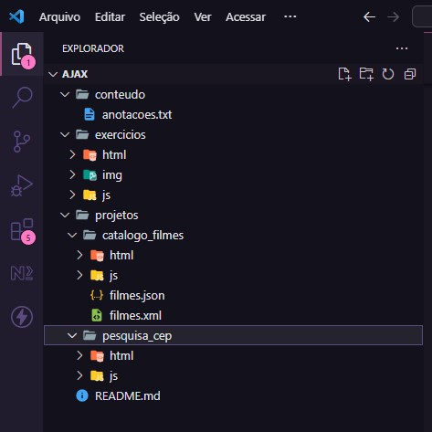
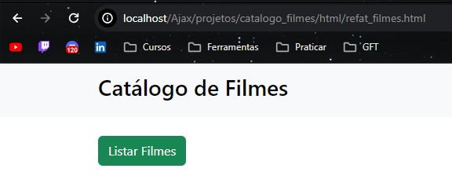
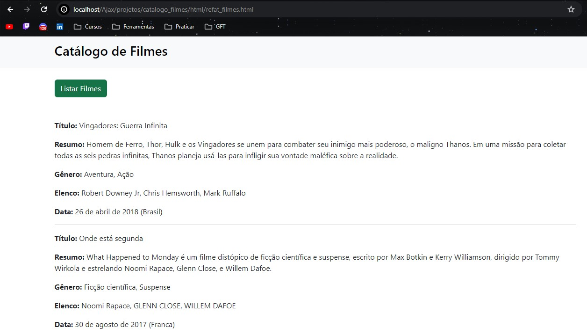
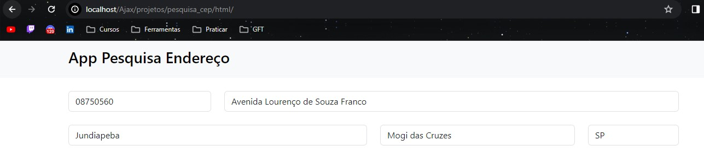

<h1 align="center"> AJAX: FUNDAMENTOS, EXERCÍCIOS E PROJETOS </h1>

Esse projeto resume-se no aprendizado do método Ajax através dos seus fundamentos, exercícios e aplicação do conteúdo absorvido em projetos simples, porém, com foco na prática dos conhecimentos adquiridos.  

  

  <a href="#-tecnologias">Tecnologias</a>&nbsp;&nbsp;&nbsp;|&nbsp;&nbsp;&nbsp;
  <a href="#-objetivo-do-projeto">Objetivo do Projeto</a>&nbsp;&nbsp;&nbsp;|&nbsp;&nbsp;&nbsp;
  <a href="#-como-utilizar">Como utilizar </a>&nbsp;&nbsp;&nbsp;|&nbsp;&nbsp;&nbsp;
  <a href="#-funcionalidades">Funcionalidades</a>&nbsp;&nbsp;&nbsp;|&nbsp;&nbsp;&nbsp;
  <a href="#-links">Links</a>&nbsp;&nbsp;&nbsp;

 

## 🚀 Tecnologias

Esse projeto foi desenvolvido com as seguintes tecnologias:

- HTML
- Bootstrap
- JavaScript
- PHP
- Xampp
- Fundamentos do ES-6

Para utilizar o Xampp siga as instruções abaixo e verifique sua documentação na aba Links:
- Documentação para instalar: https://www.apachefriends.org/pt_br/download.html -> 8.2.12;
- Como instalar:
    - Escolher o sistema operacional;
    - Escolher a versão do programa;
    - Selecionar os componentes;
    - Servidor: apache e mysql;
    - Linguagem de programação: PHP e PHPMyAdmin;
    - Selecionar a pasta C:\xampp;
    - Permitir que o Apache HTTP Server faça comunicação com redes públicas.

## 💻 Objetivo do Projeto

O projeto tem o objetivo de tornar acessível as informações sobre algumas tecnologias front-end para desenvolvedores que estão iniciando seus estudos. Nesse caso, iremos enfatizar fundamentos do método Ajax.  

É possível observar que outras tecnologias estarão presentes nos exercícios e projeto prático, mas o foco é o aprendizado da manipulação do Ajax e sua prática para colaborar com a fixação do conteúdo.  

Para maior eficiência, sugiro a tentativa de aplicar os conceitos e não somente reescrever o material contido neste repositório.

## 👨‍💻 Como Utilizar

Para melhorar a compreensão e facilitar o manuseio do projeto, os assuntos foram divididos em algumas pastas que contêm matéria teórica e exemplos, exercícios, projeto e anotações.  

- A pasta "conteúdo" separa toda a matéria teórica e exemplos de aplicação;  
- A pasta "exercícios" armazena todas as atividades para praticar os assuntos abordados;  
- A pasta "projetos" é sobre os projetos práticos Catálogo de Filmes e Pesquisa CEP. Nelas contém o arquivo .js para lógica, os arquivos .html referentes ao template da aplicação e os arquivos .json e .xml que contemplam as informações que serão manuseadas;    

Veja a imagem abaixo:  

  

## 🛠 Funcionalidades

Os projetos Catalogo de Filmes e Pesquisa CEP são formas para aplicar seus conhecimentos. Ressalto que a aplicação é simples, mas cumpre seu objetivo.  

- Nela é possível listar os filmes encontrados no arquivo filmes.json:   
    

      
      
    

     

- Ao inserir o CEP, a API pública Via CEP retorna os dados sugeridos na tela:  
    

      
    
  

## 🔗 Links

- Instalação do [VSCode](https://code.visualstudio.com/Docs)
- Documentação do [HTML](https://developer.mozilla.org/pt-BR/docs/Web/HTML)
- Documentação do [Bootstrap](https://getbootstrap.com/docs/5.3/getting-started/introduction/)
- Documentação do [JS](https://developer.mozilla.org/pt-BR/docs/Web/JavaScript)
- Documentação do [PHP](https://developer.mozilla.org/pt-BR/docs/Glossary/PHP)
- Documentação [Xampp](https://www.apachefriends.org/pt_br/index.html)